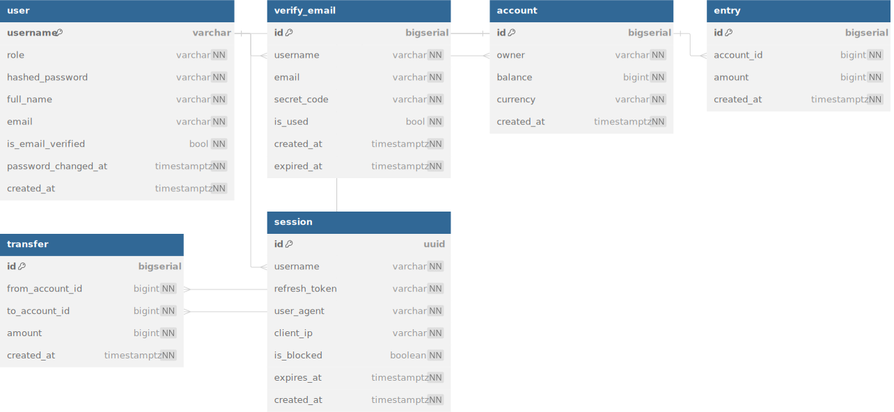

# Simple Bank
Simple Bank is a Golang learning project. It provides APIs for the frontend to do the following things:
- Create and mange bank accounts.
- Record all balance changes to each of the accounts.
- Performance a money transfer between 2 accounts.

The service is written by Go and aim to learn those topic belows:

- Gin
- gorm, sqlx & sqlc, golang migration
- How to use GitHub Action to run unit tests automatically.
- Redis

## Database

